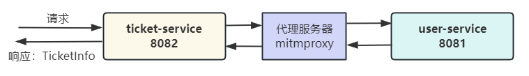

# 基于 Spring Boot 的微服务远程调用极简 Demo
## 环境
JDK 17 + Spring Boot 3.2.3
## Demo 调用关系示意图

## Demo 部署
### 通过 Docker-compose
1. 自行将 `demo-` 开头的各个模块编译打包成 jar 包，注意路径及名称：
    ```shell
    demo-ticket-service/target/demo-ticket-service-0.0.1-SNAPSHOT.jar
    demo-user-service/target/demo-user-service-0.0.1-SNAPSHOT.jar
    ```
2. 通过 docker-compose 部署：
    ```shell
    docker-compose up --build -d
    # 停止并删除容器：docker-compose down
    ```
3. 测试
    - OpenFeign 调用
        ```shell
        curl http://localhost:8082/buyTicket/feign/1
        # User(id=1, name=张三), station 上海
        ```
    - RestTemplate 调用
        ```shell
        curl http://localhost:8082/buyTicket/restful/1
        # User(id=1, name=张三), station 北京
        ```
   
   URL末尾数字为1或2时，查询的是MySQL中的数据；为3或4时，查询的是User服务内部直接初始化的模拟数据

4. 查看 mitmproxy 拦截到的 HTTP 请求：[http://localhost:8900/](http://localhost:8900/)

5. mitmproxy 所用的脚本位于 `./demo-interceptor/demo.py` 中，已挂载到容器内部 `/demo-interceptor` 目录，且 mitmproxy 支持脚本热更新，因此修改 `./demo-interceptor/demo.py` 时会立即生效，无需重启容器或重新执行命令