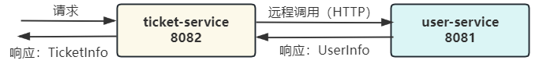

# 基于 Spring Boot 的微服务远程调用极简 Demo
## 环境
JDK 17 + Spring Boot 3.2.3
## Demo 调用关系示意图

## Demo 部署
1. 自行将 `demo-` 开头的各个模块编译打包成 jar 包，注意路径及名称：
    ```
    demo-ticket-service/demo-ticket-service-0.0.1-SNAPSHOT.jar
    demo-user-service/demo-user-service-0.0.1-SNAPSHOT.jar
    ```
2. 通过 docker-compose 部署：
    ```shell
    docker-compose up -d
    # 停止并删除容器：docker-compose down
    ```
3. 测试
    - OpenFeign 调用
        ```shell
        curl http://localhost:8082/buyTicket/feign/1
        # User(id=1, name=张三), station 上海
        ```
    - RestTemplate 调用
        ```shell
        curl http://localhost:8082/buyTicket/restful/1
        # User(id=1, name=张三), station 北京
        ```
## OpenTelemetry + Jaeger 链路追踪组件部署
见 [jaeger 分支](https://github.com/StreamAzure/Microservice-Tiny-Demo/tree/jaeger)