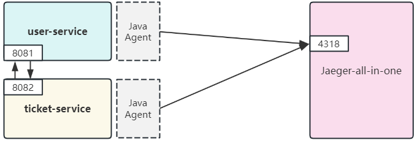

# 基于 Spring Boot 的微服务远程调用极简 Demo
## 环境
JDK 17 + Spring Boot 3.2.3
## Demo 调用关系示意图


## Demo 部署
见 master 分支

## OpenTelemetry + Jaeger 链路追踪组件部署
在上述微服务 Demo 的基础上，可添加 OpenTelemetry + Jaeger 进行链路追踪，通过 Jaeger UI 观察微服务调用过程，如下图所示：


### 部署方式
本部署采用**无侵入方式**，即无需修改微服务任何配置及代码，仅需在启动微服务容器时添加 OpenTelemetry 提供的 opentelemetry-javaagent.jar.

1. 获取 `opentelemetry-javaagent.jar`：
    
    - 在 demo-ticket-service/Dockerfile 和 demo-user-service/Dockerfile 中，通过 ADD 命令在构建镜像时自动从网络获取：
        ```yml
        ADD https://github.com/open-telemetry/opentelemetry-java-instrumentation/releases/latest/download/opentelemetry-javaagent.jar .
        ```
    - 如果存在网络问题，也可手动下载 jar 包后，放置到 demo-ticket-service 和 demo-user-service 目录下（默认方式）

2. docker-compose 打包镜像并部署，提供以下 2 种部署方式：
    
    - （**默认方式**）无 Collector。从微服务收集的 OTLP 数据直接发送至 Jaeger（Jaeger 版本要求 v1.35 +）
        
        ```shell
        # 启动容器
        docker-compose -f docker-compose-no-collector up -d
        ```
    - 有 Collector。从微服务收集的 OTLP 数据先发送至 Otel Collector，再转发至 Jaeger
        
        **注意**：需要先修改 `demo-ticket-service` 及 `demo-user-service` 目录下的 Dockerfile：
        ```yml
        # ENV OTEL_EXPORTER_OTLP_ENDPOINT=http://jaeger-service:4318
        # 修改为：
        ENV OTEL_EXPORTER_OTLP_ENDPOINT=http://otel-collector:4318
        ```
        
        ```shell
        # 启动容器
        docker-compose -f docker-compose-with-collector up -d
        ```

3. 执行 workload，通过 Jaeger UI 查看 Trace 数据
    
    ```shell
    chmod +x workload.sh
    . workload.sh
    # 启动脚本，每隔1s对Ticket服务发送请求，触发微服务调用
    ```
    访问 Jaeger UI： http://localhost:16686

## 注意事项
- 默认设置下，agent 通过 okHTTP （即 HTTP 协议）对外发送 OLTP 数据，因此 ENDPOINT 必须设置为数据接收方（无论是 Otel Collector 还是 Jaeger）的 4318 端口
    > https://opentelemetry.io/docs/languages/java/exporter
    >
    > ……`io.opentelemetry:opentelemetry-exporter-sender-okhttp` - The default sender, included automatically with opentelemetry-exporter-otlp and bundled with the OpenTelemetry Java agent. ……
- 对于无 Collector 场景，Jaeger 版本必须为 1.35+，且在 Jaeger 容器启动设置中需要设置环境变量 `COLLECTOR_OTLP_ENABLED=true` 
- 在一些旧文档中，可能会在 agent 处配置 Jaeger Exporter 来将数据直接导出给 Jaeger 的 14268 端口。但在最新（1.35.0+）的 agent 中，[**Jaeger Exporter 已被弃用**](https://github.com/open-telemetry/opentelemetry-java-instrumentation/pull/10524)，因此这里并没有采用该配置方式。
